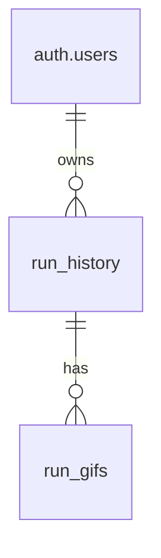

# Database Schema

The Digest AI API uses Supabase as its database backend. Below are the table schemas and their relationships.

## Tables

### Run History (`run_history`)

Stores the main task execution history.

| Column | Type | Description |
|--------|------|-------------|
| id | uuid | Primary key |
| user_id | string | Foreign key to Supabase auth.users |
| task | string | Description of the executed task |
| progress | jsonb | Array of progress events |
| result | string | Task execution result (nullable) |
| error | string | Error message if task failed (nullable) |
| created_at | timestamp | Record creation timestamp |

### Run GIFs (`run_gifs`)

Stores GIF recordings of task executions.

| Column | Type | Description |
|--------|------|-------------|
| id | uuid | Primary key |
| history_id | uuid | Foreign key to run_history.id |
| gif_content | text | Base64 encoded GIF content |
| created_at | timestamp | Record creation timestamp |

## Relationships



## Indexes

### Run History
- Primary Key: `id`
- Index on: `user_id`
- Index on: `created_at`

### Run GIFs
- Primary Key: `id`
- Index on: `history_id`
- Foreign Key Constraint: `history_id` references `run_history(id)`

## Data Types

### Progress Event Structure
```json
{
  "type": "string",
  "message": "string",
  "timestamp": "string"
}
```

Types:
- `info`: General information
- `error`: Error message
- `success`: Success message
- `progress`: Progress update

## Security

- Row Level Security (RLS) policies ensure users can only access their own data
- Sensitive data is encrypted at rest
- Automatic backup and point-in-time recovery enabled

## Maintenance

- Regular vacuuming scheduled
- Indexes are automatically maintained
- Monitoring and alerts set up for database health 